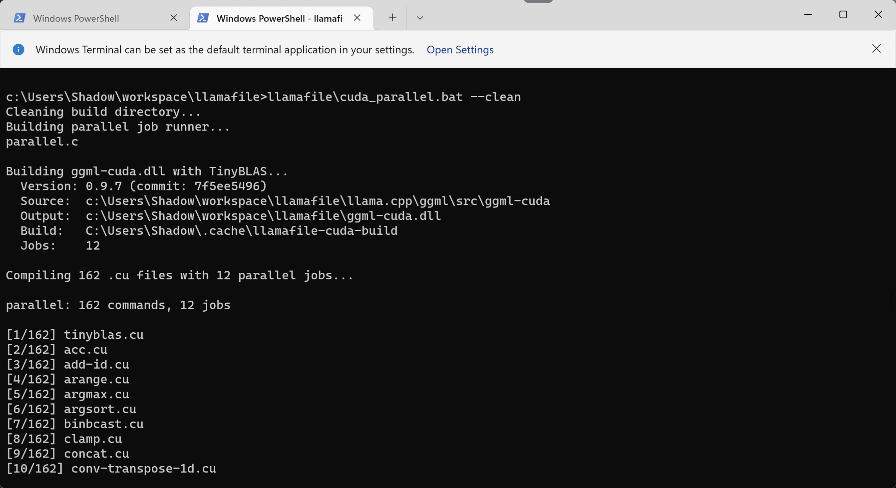

This document provides instructions to replicate our Windows DLL builds.

# Requirements:
- Windows 11 (x64)
- Build Tools for Visual Studio 2022
- [MSYS2](https://www.msys2.org/)
- [CUDA 12.9.1](https://developer.nvidia.com/cuda-12-9-1-download-archive?target_os=Windows&target_arch=x86_64&target_version=11)
- [AMD HIP SDK](https://www.amd.com/en/developer/resources/rocm-hub/hip-sdk.html) 7.1.1
- [Vulkan SDK](https://vulkan.lunarg.com/sdk/home#windows) 1.4.341.1

# In the MSYS shell

As our Makefile makes massive use of unix shell applications, it's much easier to just replicate that environment. We'll need it just to setup the repo (with `make setup`), which initializes all the submodules and applies our patches to the original code. In theory after the setup you should also be able to run `make -j8` to build llamafile with cosmocc on Windows (but honestly, why?)

- install the required tools (vim is not really required)
```
pacman -S git patch unzip wget make vim
```

- create a build workspace
```
mkdir /c/Users/Your_Username/workspace
cd /c/Users/Your_Username/workspace
```

- clone the repo
```
git clone https://github.com/mozilla-ai/llamafile
```

- setup
```
cd llamafile
make setup
```

# In the Windows terminal

After the repo is set up, you can build the cuda / rocm / vulkan DLLs as follows.
The .bat files to run the builds are in the `llamafile` directory and accept the following
parameters:

- `--clean` to restart a build from scratch
- `--output` to provide a custom output filename for the dll (default is ggml-xxxx.dll in the current directory
for xxxx in (cuda, rocm, vulkan)
- only for the cuda libraries, you also have the `--cublas` option to link the library against NVIDIA's cublas instead of tinyblas

Also note that for cuda and rocm libraries there are `*_parallel.bat` scripts that should work faster
by parallelizing compilation and taking advantage of your compute. Here's how you call the build scripts:

- cd to the llamafile dir and start CUDA parallel build (this will run for a while...)
```
cd c:\Users\Your_Username\Workspace\llamafile
llamafile\cuda_parallel.bat
```

 

- run ROCm parallel build as follows:
```
llamafile\rocm_parallel.bat
```

- run Vulkan build as follows (parallel is not needed, this is usually much faster than the other two):
```
llamafile\vulkan.bat
```

At the end of this process, you should have the following libraries available in your llamafile directory (note that sizes might differ):
```
03/31/2026  02:15 PM       717,095,936 ggml-cuda.dll
03/31/2026  02:44 PM       502,854,656 ggml-rocm.dll
03/31/2026  02:46 PM        31,482,880 ggml-vulkan.dll
```

To run llamafile with these libraries, add them in your home directory or bundle them in your llamafile (see [Creating a llamafile](creating_llamafiles.md)).

## Verifying numerical consistency (release gate)

Before shipping a GPU library, verify that it computes the same results as
the CPU reference. The `backend_ops_test` harness wires upstream ggml's
`test-backend-ops` into llamafile's real runtime loading path (cosmo_dlopen
+ ms_abi thunks), so it validates the actual DSO artifact and ABI boundary.

Build it once (it is not part of the default test suite):

```
make o//tests/backend_ops_test
```

Copy `o//tests/backend_ops_test` next to the DSO(s) on the target machine
(rename to `backend_ops_test.exe` on Windows) and run the fast subset:

```
backend_ops_test test -o MUL_MAT
backend_ops_test test -o MUL_MAT_ID
backend_ops_test test -o FLASH_ATTN_EXT
```

A full `backend_ops_test test` run covers every op and takes much longer.
Every backend DSO present is loaded and tested; the summary at the end must
report all backends passing.

If a mismatch appears, attribute it before blaming the GPU: the CPU
reference itself goes through llamafile's tinyBLAS/iqk fast path. Rerun
with `LLAMAFILE_DISABLE_SGEMM=1` to compare against vanilla ggml — if the
failures disappear, the bug is in llamafile's CPU kernels, not the GPU
library (this is how the iq4_xs, bf16, and permuted-stride CPU bugs were
found).
