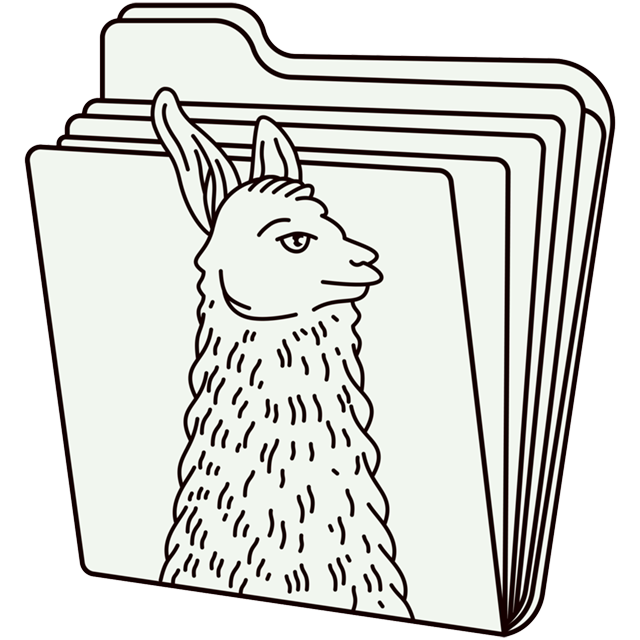

# llamafile

**llamafile lets you distribute and run LLMs with a single file.**

llamafile is a [Mozilla Builders](https://builders.mozilla.org/) project (see its [announcement blog post](https://hacks.mozilla.org/2023/11/introducing-llamafile/)), now revamped by [Mozilla.ai](https://www.mozilla.ai/open-tools/llamafile). 

Our goal is to make open LLMs much more
accessible to both developers and end users. We're doing that by
combining [llama.cpp](https://github.com/ggerganov/llama.cpp) with [Cosmopolitan Libc](https://github.com/jart/cosmopolitan) into one
framework that collapses all the complexity of LLMs down to
a single-file executable (called a "llamafile") that runs
locally on most operating systems and CPU archiectures, with no installation.

llamafile also includes **[whisperfile](whisperfile/index.md)**, a single-file speech-to-text tool built on [whisper.cpp](https://github.com/ggerganov/whisper.cpp) and the same Cosmopolitan packaging. It supports transcription and translation of audio files across all the same platforms, with no installation required.

## v0.10.0

**llamafile versions starting from 0.10.0 use a new build system**, aimed at keeping our code more easily 
aligned with the latest versions of llama.cpp. This means they support more recent models and functionalities,
but at the same time they might be missing some of
the features you were accustomed to (check out [this doc](https://github.com/mozilla-ai/llamafile/blob/main/README_0.10.0.md) for a high-level description of what has been done). If you liked
the "classic experience" more, you will always be able to access the previous versions from our
[releases](https://github.com/mozilla-ai/llamafile/releases) page. Our pre-built llamafiles always
show which version of the server they have been bundled with ([0.9.* example](https://huggingface.co/mozilla-ai/llava-v1.5-7b-llamafile), [0.10.* example](https://huggingface.co/mozilla-ai/llamafile_0.10.0)), so you will always know
which version of the software you are downloading.

> **We want to hear from you!**
Whether you are a new user or a long-time fan, please share what you find most valuable about llamafile and what would make it more useful for you.
[Read more via the blog](https://blog.mozilla.ai/llamafile-returns/) and add your voice to the discussion [here](https://github.com/mozilla-ai/llamafile/discussions/809).

## How llamafile works

A llamafile is an executable LLM that you can run on your own
computer. It contains the weights for a given open LLM, as well
as everything needed to actually run that model on your computer.
There's nothing to install or configure (with a few caveats, discussed
in subsequent sections of this document).

This is all accomplished by combining llama.cpp with Cosmopolitan Libc,
which provides some useful capabilities:

1. llamafiles can run on multiple CPU microarchitectures. We
added runtime dispatching to llama.cpp that lets new Intel systems use
modern CPU features without trading away support for older computers.

2. llamafiles can run on multiple CPU architectures. We do
that by concatenating AMD64 and ARM64 builds with a shell script that
launches the appropriate one. Our file format is compatible with WIN32
and most UNIX shells. It's also able to be easily converted (by either
you or your users) to the platform-native format, whenever required.

3. llamafiles can run on six OSes (macOS, Windows, Linux,
FreeBSD, OpenBSD, and NetBSD). If you make your own llama files, you'll
only need to build your code once, using a Linux-style toolchain. The
GCC-based compiler we provide is itself an Actually Portable Executable,
so you can build your software for all six OSes from the comfort of
whichever one you prefer most for development.

4. The weights for an LLM can be embedded within the llamafile.
We added support for PKZIP to the GGML library. This lets uncompressed
weights be mapped directly into memory, similar to a self-extracting
archive. It enables quantized weights distributed online to be prefixed
with a compatible version of the llama.cpp software, thereby ensuring
its originally observed behaviors can be reproduced indefinitely.

5. Finally, with the tools included in this project you can create your
*own* llamafiles, using any compatible model weights you want. You can
then distribute these llamafiles to other people, who can easily make
use of them regardless of what kind of computer they have.

## Licensing

While the llamafile project is Apache 2.0-licensed, our changes
to llama.cpp are licensed under MIT (just like the llama.cpp project
itself) so as to remain compatible and upstreamable in the future,
should that be desired.

The llamafile logo on this page was generated with the assistance of DALL·E 3.

